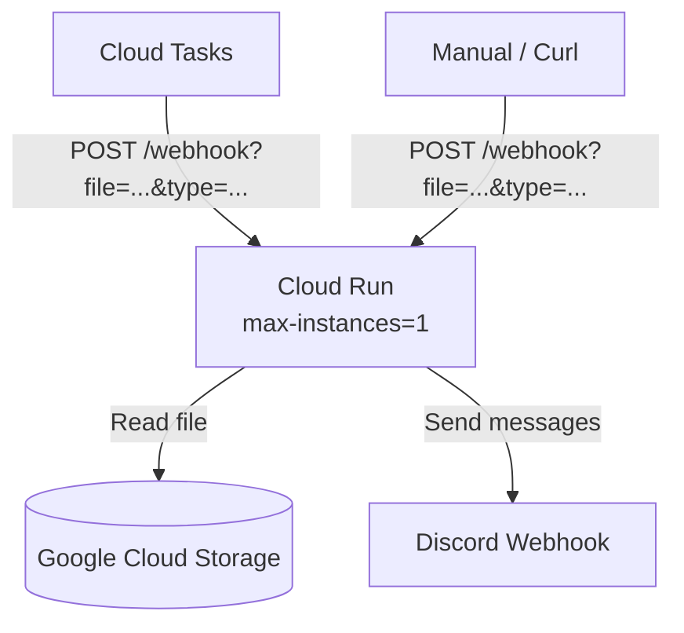

# TL;DR Discord Service — Project Plan

## 1. Overview

Microservice yang bertugas membaca file dari Google Cloud Storage berdasarkan trigger (Cloud Tasks / manual HTTP), lalu mengirimkan isinya ke Discord webhook.

Trigger tunggal via **HTTP endpoint** (`POST /webhook?file=<path>&type=success|failed`), dipanggil oleh Cloud Tasks atau manual.

---

## 2. Tech Stack

| Komponen | Pilihan |
|---|---|
| Bahasa | **Go** |
| Cloud Run | **max-instances=1** |
| Storage | **Google Cloud Storage** (ADC / Workload Identity) |
| Queue | **Cloud Tasks** (HTTP push ke Cloud Run) |
| Discord | **Webhook URL** (1 URL via env var / Secret Manager) |

---

## 3. Architecture



### Flow

1. **Cloud Tasks** mengirim HTTP request ke Cloud Run endpoint dengan query params `file` & `type`.
2. Cloud Run membaca file dari GCS sesuai path.
3. Berdasarkan `type`:
   - **success**: Baca file (markdown/txt), batch per N baris (default 5, configurable via env), kirim ke Discord tiap batch dengan delay 2 detik.
   - **failed**: Baca file (JSON), parse `processName`, `traceInfo` (`emailId`, `newsTitle`, `newsUrl`), `message`, kirim sebagai Discord embed.
4. Delay 2 detik antar pengiriman untuk menghindari rate limit Discord.

---

## 4. API Spec

### `POST /webhook`

Trigger utama — satu-satunya entry point.

**Query Parameters:**

| Parameter | Type | Required | Description |
|---|---|---|---|
| `file` | string | yes | Path file di GCS bucket |
| `type` | string | yes | `success` atau `failed` |

**Response:**

| Status | Description |
|---|---|
| `200 OK` | Pesan berhasil dikirim ke Discord |
| `400 Bad Request` | Parameter tidak valid |
| `404 Not Found` | File tidak ditemukan di GCS |
| `500 Internal Server Error` | Gagal proses/kirim |

---

## 5. Handler Logic

### 5.1 Success Flow

```
Input: file path → file .md atau .txt di GCS
1. Baca file dari GCS
2. Split content per N baris (default 5, env: BATCH_LINE_COUNT)
3. Untuk tiap batch:
   a. Kirim ke Discord webhook sebagai plain text message
   b. Sleep 2 detik
4. Return 200
```

### 5.2 Failed Flow

```
Input: file path → file .json di GCS
Expected JSON structure:
{
  "processName": "string",
  "traceInfo": {
    "emailId": "string",
    "newsTitle": "string",
    "newsUrl": "string"
  },
  "message": "string"
}
1. Baca & parse JSON dari GCS
2. Buat Discord embed:
   - Title: ❌ Process Failed: {processName}
   - Fields:
     - Email ID: {traceInfo.emailId}
     - News Title: {traceInfo.newsTitle}
     - News URL: {traceInfo.newsUrl}
     - Error Message: {message}
   - Color: Red (0xE74C3C)
3. Kirim embed ke Discord webhook
4. Return 200
```

---

## 6. Environment Variables

| Variable | Required | Default | Description |
|---|---|---|---|
| `GCS_BUCKET_NAME` | yes | — | Nama GCS bucket tempat file disimpan |
| `DISCORD_WEBHOOK_URL` | yes | — | Discord webhook URL |
| `BATCH_LINE_COUNT` | no | `5` | Jumlah baris per batch untuk success flow |
| `DISCORD_DELAY_MS` | no | `2000` | Delay antar kirim (ms) |
| `PORT` | no | `8080` | Port HTTP server |

---

## 7. Deployment (Cloud Run)

- **max-instances=1**)

### 7.1 Build & Deploy

```bash
# Build container
docker build -t gcr.io/<project>/tldr-discord-service .

# Push ke Artifact Registry
docker push gcr.io/<project>/tldr-discord-service

# Deploy ke Cloud Run
gcloud run deploy tldr-discord-service \
  --image gcr.io/<project>/tldr-discord-service \
  --max-instances 1 \
  --no-cpu-throttling \
  --set-env-vars "GCS_BUCKET_NAME=...,DISCORD_WEBHOOK_URL=...,BATCH_LINE_COUNT=5"
```

> **Kenapa max-instances=1?** Urutan pengiriman pesan sangat penting. Dengan single instance dan Cloud Tasks yang memproses satu task dalam satu waktu, tidak ada risiko race condition atau pesan terkirim tidak urut.

### 7.2 Cloud Tasks Queue

```
Queue: tldr-process-queue
- Rate: 1 task/detik (biar gak overload Cloud Run)
- Max attempts: 3
- Target: Cloud Run service URL + endpoint /webhook
```

---

## 8. Project Structure

```
tldr-discord-service/
├── cmd/
│   └── main.go              # Entry point
├── internal/
│   ├── handler/
│   │   └── webhook.go        # HTTP handler
│   ├── gcs/
│   └── reader.go             # GCS file reader
│   ├── discord/
│   │   └── client.go         # Discord webhook client
│   └── model/
│       └── types.go          # Shared types/structs
├── go.mod
├── go.sum
├── Dockerfile
└── README.md
```

---

## 9. Testing Strategy

1. **Unit test**: Mocks**: Mock GCS client & Discord webhook client untuk unit test
2. **Local Dev**: Bisa run langsung dengan env var + curl ke endpoint
3. **E2E**: Deploy dulu ke Cloud Run, test manual dengan curl, verifikasi pesan masuk ke Discord
